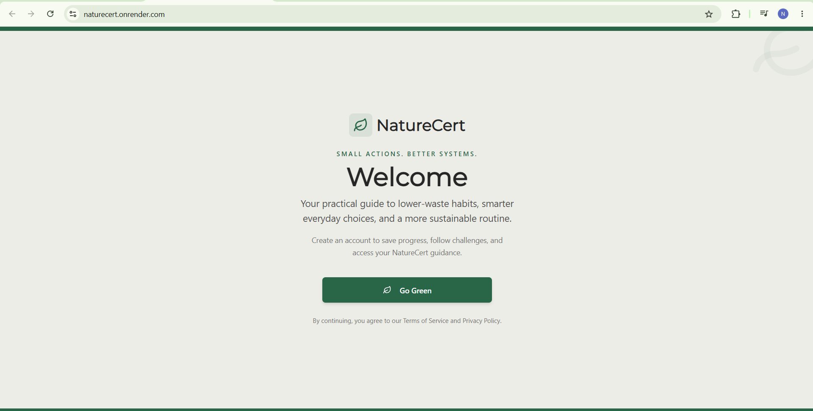
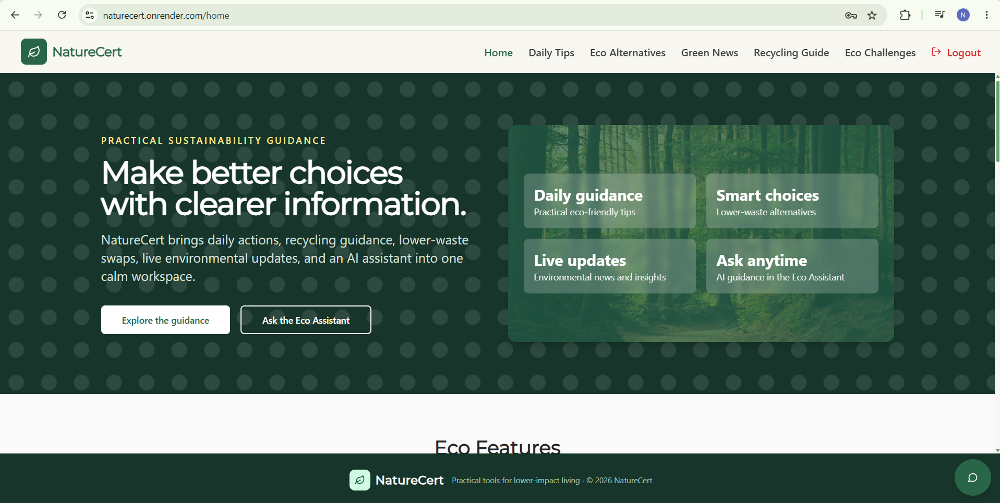
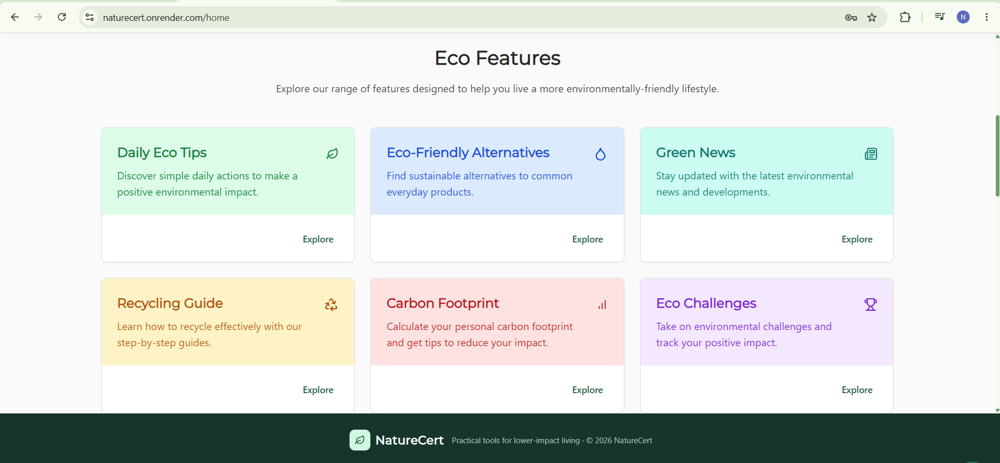
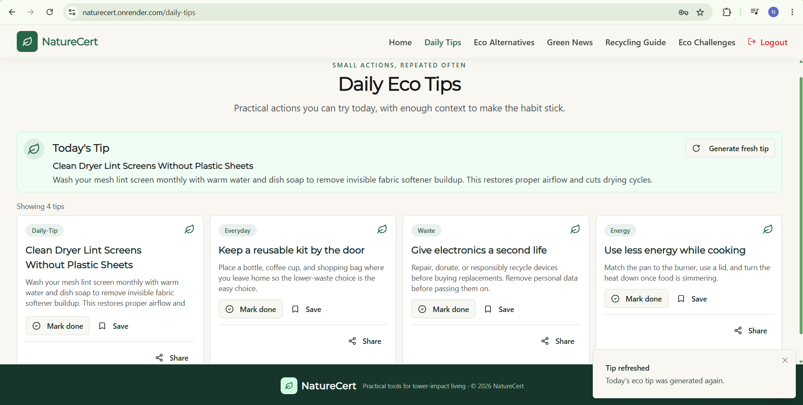
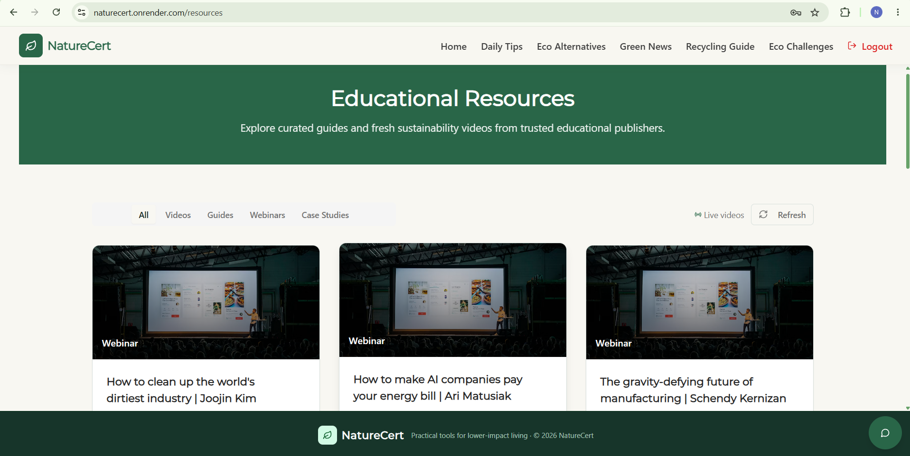

# NatureCert

NatureCert is a full-stack sustainability platform built to help users make eco-friendly decisions through daily guidance, educational content, challenge participation, and AI-driven support. It combines a clean, modern user experience with a strong backend and personalized engagement layer.

## Features

- Daily eco tips and habit-building guidance
- Sustainable living resources, news, and recycling education
- Eco challenges with progress tracking and completion flow
- User authentication with protected routes and personalized access
- AI-powered Eco Assistant for sustainability and waste-related questions
- Contact form for user engagement and inquiry collection
- Responsive dashboard experience for mobile and desktop users

### AI and smart assistance

The app includes an AI assistant that helps users with sustainability-focused questions such as recycling guidance, waste reduction, energy-saving habits, and general eco-awareness. It uses a Gemini/OpenAI-backed flow with a local fallback so the experience remains useful even without external API credentials.

## Deployed app

Open the live application here:

https://naturecert.onrender.com/

The app is deployed and ready to use in production with the required environment configuration already set for the hosted environment.

## Local Setup

Requirements: Node.js 20+, a PostgreSQL database connection, and optionally a Gemini or OpenAI API key.

```bash
npm install
copy .env.example .env  # Windows
npm run dev
```

Open http://localhost:5000 to access the app.

## Architecture Decisions and Trade-offs

- React frontend manages the user-facing experience and content flows
- Express server handles API routes, authentication, and protected access
- PostgreSQL with Drizzle ORM provides a structured relational data model
- Passport.js session-based auth keeps user access simple and secure
- AI support is optional and designed to degrade gracefully without breaking core product flows
- The app separates frontend routes, API logic, and data access to keep the codebase easier to extend and maintain

The application is structured around a clear product flow: users browse sustainability content, participate in eco challenges, interact with the assistant, and receive practical guidance that encourages habit change over time.

## Technology

- React 18 and Vite
- TypeScript
- Tailwind CSS
- Node.js and Express
- PostgreSQL / Neon database
- Drizzle ORM
- Passport.js for authentication
- Gemini and OpenAI API support
- Responsive UI and modern component system

## Validation

```bash
npm run check
npm run build
```

## Why this project matters

NatureCert reflects a real-world product mindset rather than a static demo. It combines user experience, product logic, authentication, data modeling, and AI assistance into a single application that feels practical and complete.

The project demonstrates strong full-stack development skills, including:

- frontend product design and responsive UI engineering
- REST API and backend route creation
- database-backed application workflows
- secure user authentication
- AI service integration with graceful fallback behavior
- an end-to-end experience that feels usable, relevant, and scalable

## Future Improvements

- expand user personalization and dashboard analytics
- add richer challenge tracking and goal history
- improve AI response quality with more contextual eco guidance
- add advanced admin or content-management features

## Screenshots

### Welcome, sign-in & sign-up

<p align="center">
  
  
</p>

### Home and eco experience

<p align="center">
  
  
</p>

### Features and AI experience

<p align="center">
  
  
  
  
</p>

## Project Structure

```text
NatureCert/
├── client/
│   └── src/
├── server/
│   ├── auth.ts
│   ├── db.ts
│   ├── index.ts
│   ├── routes.ts
│   ├── storage.ts
│   └── vite.ts
├── shared/
│   └── schema.ts
├── drizzle.config.ts
├── package.json
├── tailwind.config.ts
├── tsconfig.json
├── vite.config.ts
├── README.md
└── .env
```

## Getting Started

### Prerequisites

- Node.js 20+
- PostgreSQL database connection
- npm

### Install dependencies

```bash
npm install
```

### Configure environment variables

Create a `.env` file in the project root:

```env
DATABASE_URL=your_postgresql_connection_string
SESSION_SECRET=your_secure_session_secret
PORT=5000

GEMINI_API_KEY=your_gemini_key
GEMINI_MODEL=gemini-2.5-flash
OPENAI_API_KEY=your_openai_key
OPENAI_MODEL=gpt-4o-mini
```

### Initialize database

```bash
npm run db:push
```

### Run the app

```bash
npm run dev
```


---

Built to demonstrate a practical sustainability product, full-stack engineering, and AI-enabled user experience design.
